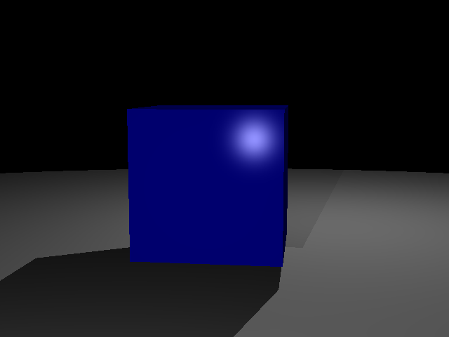

# Travail pratique - ray tracing
Travail pratique complété dans le cadre du cours d'infographie.

Ce travail:
* Implémente les tests d'intersection pour un plane, une sphere et les meshs (triangles).
* Implémente le calcul de l'illumintion locale.
* Implémente le calcul des rayons d'ombre.
* Implémente les rayons de réflexion miroir.

## Images générées

:--:
*Scène Finale*

:--:
*Triangle*

:--:
*Cube*

:--:
*Teapot*

:--:
*Icosahedron*
